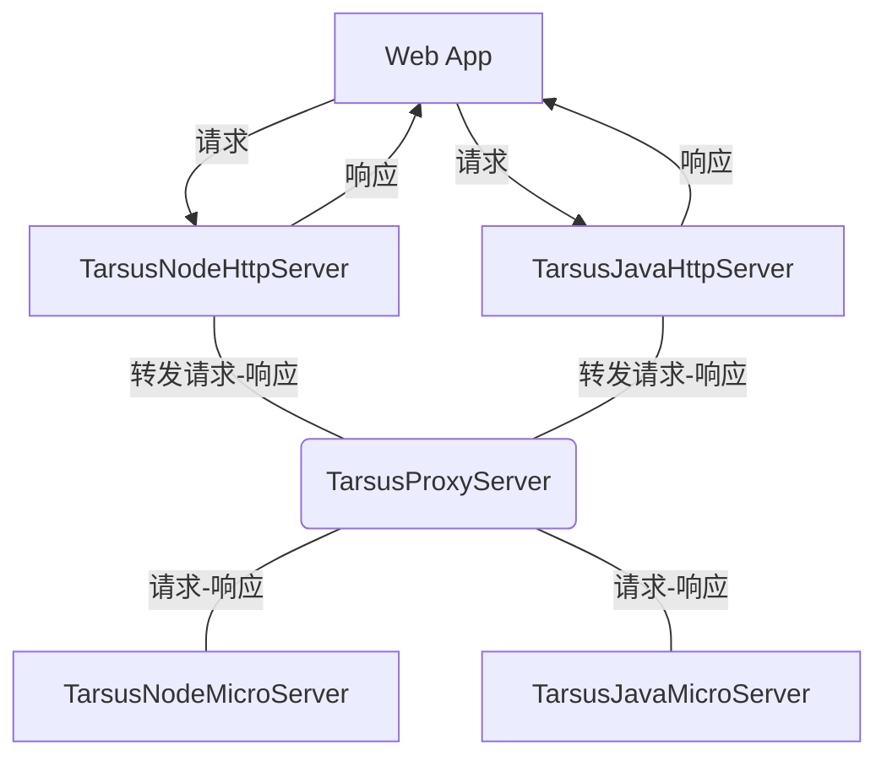

# @Tarsus/Java Http服务模块

## 整合的仓库
- [@Tarsus/Node](https://github.com/chelizichen/Tarsus) 包含 Http服务  微服务模块 依赖注入 ORM 命令行 等多个开发包的库
- [@Tarsus/Java-Proxy](https://github.com/chelizichen/Tarsus-Java-Proxy) SpringBoot，可以提供Http 服务，也可以调用微服务
- [@Tarsus/Java](https://github.com/chelizichen/Tarsus-Java) Java 微服务模块 示例代码


## 说明

````TXT
使用 Java 作为 中间层 可以使用 Http 服务 也可以调用 Ado—Node 的微服务
````

## 微服务架构模型



